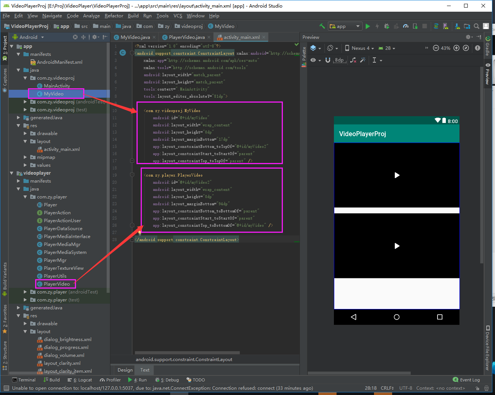

# VideoPlayer
视频播放组件（具有操作控件），可全屏，可缩放，有进度条等控制组件，如各个视频软件的播放器组件  
下载解压后Android studio 打开VideoPlayerProj编译即可运行

### 效果展示

<!---->

### 使用
##### 1.在项目依赖中添加 compile 'com.zy:videoplayer:1.0.0'

<!---->

##### 2.在清单文件（AndroidManifest.xml）中，你要使用视频播放组将的活动（acitvity）上，
添加android:configChanges="orientation|screenSize|keyboardHidden"和android:screenOrientation="portrait" 属性，
如下图

<!---->

##### 3.代码调用
###### 3.1 layout布局文件代码中添加播放器ui

###### 2.2 Acitivity文件代码 请查看源文件（[MyVideo.java](./VideoPlayerProj/app/src/main/java/com/zy/videoproj/MyVideo.java)）

###### 2.3 Acitivity文件代码 请查看源文件（[MainActivity.java](./VideoPlayerProj/app/src/main/java/com/zy/videoproj/MainActivity.java)）

### 欢迎交流
欢迎提问交流；若有bug，请添加bug截图或代码片段，以便更快更好的解决问题。 
欢迎大家一起交流

### [我的博客](http://blog.sina.com.cn/s/articlelist_6078695441_0_1.html)